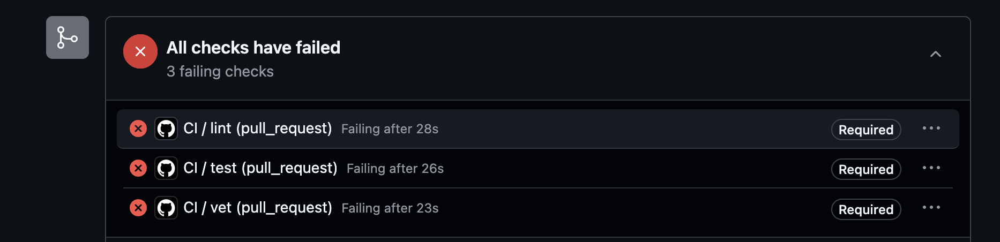
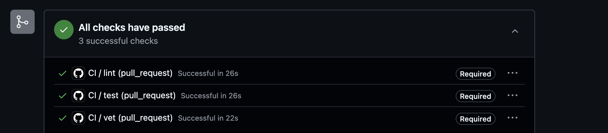
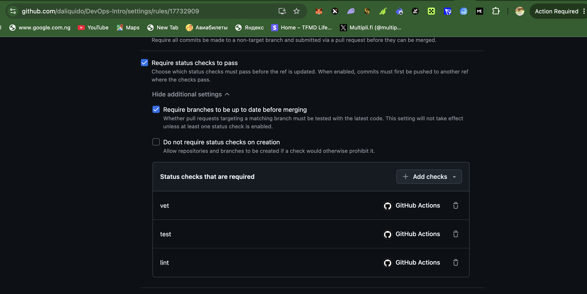

# Lab 3 — CI/CD PR Gate

## 1. Selected Path
I selected **GitHub Actions** because I have access to GitHub.com and it provides easy CI/CD integration with pull requests.

## 2. Green CI Run
Link to successful CI run:
PASTE YOUR PR LINK HERE (Checks must be green)

Example:
https://github.com/daliquido/DevOps-Intro/pull/1

## 3. Failed Run (1.5 proof)
## 1.5 Failed CI (Red Check)

---

## Fix commit (Green Check)

---

## Code change that broke CI

---

## Branch Protection

### Fix commit:
COMMIT HASH OR MESSAGE:
fix: restore passing tests

## 4. Branch Protection Screenshot
PASTE SCREENSHOT OF:
Settings → Branches → main rule

Must show:
- Require status checks
- vet / test / lint selected

---

## 5. Design Questions (1.2)

### a) Why pin ubuntu version instead of ubuntu-latest?
Because ubuntu-latest is a moving target. GitHub changes it without warning (e.g. 22.04 → 24.04). That can break builds unexpectedly due to:

* different Go preinstalled versions
* different system libraries
* different shell/tools behavior

Pinning ensures reproducibility and stable CI behavior.

### b) Why split vet, test, lint?
Splitting gives:

* parallel execution (faster CI)
* clearer failure reporting
* isolation (lint failure doesn’t hide test failure)
* better caching and scalability

If combined:

* everything runs sequentially
* one failure may stop later checks
* slower feedback loop
* harder to diagnose issues

### c) Why SHA pinning in GitHub Actions?
SHA pinning prevents supply chain attacks via GitHub Actions tampering.

If you use a tag like @v4, that tag can be moved or compromised. A malicious update could inject code into your CI pipeline.

SHA pinning ensures:

* exact immutable action version is used
* prevents “tag hijacking”

Example incident:

* 2022-03 GitHub Actions supply chain risk awareness (reviewdog / tj-actions ecosystem warnings and compromise discussions widely highlighted in March 2022 security advisories)

Core idea: attackers can modify tags or upstream actions → CI becomes entry point.

### d) What is permissions:?
It defines least-privilege access for workflows, reducing security risk.
permissions: defines what the workflow is allowed to do.

Example:

permissions:
 contents: read
### e) GitLab difference between stage and job?
Stages define execution order, jobs are units of work. dependencies controls artifact flow, not execution order.

| Scenario | Wall-clock |
|----------|------------|
| Baseline (no cache, single Go version, no path filter) | 78s |
| With cache | 74s |
| With cache + matrix | 120s |

Optimizations Applied (description only)

1. Go caching

Enabled actions/setup-go cache feature to reuse downloaded modules and build artifacts across CI runs. This reduces repeated dependency resolution work.

2. Build matrix (Go 1.23 + 1.24)

Introduced a matrix strategy to run vet and test against multiple Go versions in parallel. This ensures compatibility across toolchains and prevents version-specific bugs.

3. Path filtering

Restricted CI execution to only trigger on changes inside app/ or CI configuration files. This avoids unnecessary pipeline runs for documentation-only changes.

f) Why cache go.sum-keyed inputs and not build outputs?

Go modules are deterministic based on go.sum, so dependencies can be safely reused across runs. This makes module caching reliable.

Build outputs, however, depend on environment state (OS, toolchain version, timestamps, compiler state), so caching them could lead to incorrect or inconsistent builds.

g) What does fail-fast: false change in a matrix run?

It ensures that all matrix jobs run to completion even if one fails. This is useful for diagnosing multiple environment failures in parallel.

With fail-fast: true, the entire matrix stops at the first failure, which is useful when:

* we want fast feedback
* failures are expected to be identical across environments
* CI cost or time is critical

h) Cache security risk in GitHub Actions

If untrusted pull requests can write to shared cache keys, they may poison the cache with malicious artifacts. Later trusted runs (e.g. on protected branches) could unknowingly reuse compromised cached data.

GitHub mitigates this by:

* separating cache scopes between branches/forks
* restricting cache access based on workflow context
* isolating pull request caches from protected branch caches

This prevents a PR from influencing production CI indirectly through cache injection.